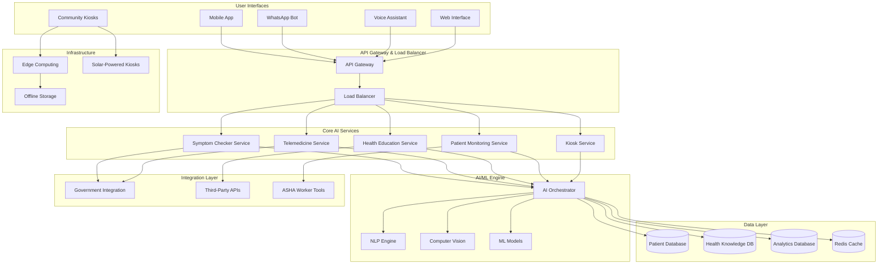

# Design Document

## Overview

The AI-powered rural healthcare services system is a comprehensive platform that extends the existing AI Rural Healthcare Assistant infrastructure to provide five key healthcare services for rural and remote areas in India. The system leverages AI, machine learning, and edge computing to deliver healthcare services through multiple channels including mobile apps, WhatsApp, voice interfaces, and solar-powered community kiosks.

The design builds upon the proven safety-first architecture of the existing working conditions assessment system, extending its multi-language support, offline functionality, and integration capabilities to serve 600K+ villages across India.

## Architecture

### High-Level Architecture



### Service Architecture

The system follows a microservices architecture with the following key principles:

1. **Service Isolation**: Each healthcare service (symptom checking, telemedicine, etc.) is implemented as an independent microservice
2. **AI-First Design**: All services leverage centralized AI/ML capabilities through the AI Orchestrator
3. **Multi-Channel Support**: Services are accessible through multiple user interfaces with consistent functionality
4. **Edge Computing**: Critical functionality is available at the edge for offline scenarios
5. **Safety Integration**: All services integrate with the existing Safety Guard system

## Components and Interfaces

### Core Service Components

#### 1. Symptom Checker Service

**Purpose**: Provides AI-driven symptom analysis and initial diagnosis recommendations

**Key Interfaces**:
- `POST /api/v1/symptom-checker/start` - Initialize symptom assessment
- `POST /api/v1/symptom-checker/submit-response` - Submit symptom responses
- `GET /api/v1/symptom-checker/analysis/{session_id}` - Get analysis results
- `POST /api/v1/symptom-checker/escalate` - Escalate to emergency services

**Integration Points**:
- AI/ML Engine for symptom analysis
- Government Systems (e-Sanjeevani) for escalation
- Safety Guard for emergency detection
- Multi-language support through Language Manager

#### 2. Telemedicine Service

**Purpose**: Facilitates AI-assisted virtual consultations between rural users and urban specialists

**Key Interfaces**:
- `POST /api/v1/telemedicine/schedule` - Schedule consultation
- `POST /api/v1/telemedicine/upload-image` - Upload medical images for analysis
- `GET /api/v1/telemedicine/queue-status` - Check consultation queue
- `POST /api/v1/telemedicine/translate` - Real-time translation service

**Integration Points**:
- Computer Vision for medical image analysis
- NLP Engine for real-time translation
- Government Systems for consultation records
- ASHA Worker Tools for consultation support

#### 3. Health Education Service

**Purpose**: Delivers personalized health education through AI chatbots

**Key Interfaces**:
- `GET /api/v1/health-education/content/{topic}` - Get educational content
- `POST /api/v1/health-education/personalize` - Get personalized recommendations
- `POST /api/v1/health-education/track-progress` - Track learning progress
- `GET /api/v1/health-education/campaigns` - Get active health campaigns

**Integration Points**:
- Generative AI for content creation
- User profile system for personalization
- SMS/Low-data delivery systems
- Regional health data for local context

#### 4. Patient Monitoring Service

**Purpose**: Provides continuous health monitoring and risk prediction

**Key Interfaces**:
- `POST /api/v1/monitoring/connect-device` - Connect monitoring devices
- `POST /api/v1/monitoring/submit-vitals` - Submit vital sign data
- `GET /api/v1/monitoring/risk-analysis/{user_id}` - Get risk analysis
- `POST /api/v1/monitoring/alert` - Send health alerts

**Integration Points**:
- IoT device APIs for data collection
- ML Models for risk prediction
- Community health records for outbreak tracking
- Family notification systems

#### 5. Community Kiosk Service

**Purpose**: Manages solar-powered healthcare kiosks in villages

**Key Interfaces**:
- `POST /api/v1/kiosk/health-check` - Perform basic health assessment
- `POST /api/v1/kiosk/medicine-check` - Check drug interactions
- `GET /api/v1/kiosk/emergency-guide` - Get emergency instructions
- `POST /api/v1/kiosk/vital-scan` - Process computer vision vital scans

**Integration Points**:
- Edge Computing infrastructure
- Computer Vision for vital scanning
- Local pharmacy databases
- Emergency contact systems

### Supporting Components

#### AI/ML Engine Components

**AI Orchestrator**
- Coordinates AI services across all healthcare modules
- Manages model versioning and deployment
- Handles AI safety and bias monitoring

**NLP Engine**
- Multi-language processing (Hindi, Marathi, Tamil, English)
- Real-time translation capabilities
- Medical terminology extraction and normalization

**Computer Vision Module**
- Medical image analysis (X-rays, skin conditions)
- Vital sign detection through camera
- Document processing for medical records

**ML Models**
- Symptom analysis models trained on Indian health data
- Risk prediction models for chronic conditions
- Outbreak detection models for community health

#### Integration Layer Components

**Government Integration Service**
- e-Sanjeevani API integration
- Ayushman Bharat Digital Mission connectivity
- Health ministry reporting interfaces

**ASHA Worker Tools**
- Training material delivery system
- Consultation support interfaces
- Community health data collection tools

**Third-Party APIs**
- Pharmacy database integrations
- Weather and environmental data services
- SMS and communication service providers

### User Interface Components

#### Mobile Application
- Native Android app optimized for low-end devices
- Offline-first architecture with data synchronization
- Voice interface support for low-literacy users

#### WhatsApp Bot
- Integration with WhatsApp Business API
- Rich media support for health education
- Automated triage and escalation workflows

#### Voice Assistant
- Speech-to-text in regional languages
- Interactive voice response (IVR) system
- Integration with existing phone infrastructure

#### Community Kiosks
- Touch-screen interface with voice guidance
- Solar power management system
- Local data storage and synchronization

## Data Models

### Core Health Data Models

#### User Profile
```typescript
interface UserProfile {
  id: string;
  phone_number: string;
  preferred_language: Language;
  location: {
    village: string;
    district: string;
    state: string;
    coordinates?: {
      latitude: number;
      longitude: number;
    };
  };
  demographics: {
    age_range: string;
    gender: string;
    occupation: string;
  };
  health_profile: {
    chronic_conditions: string[];
    allergies: string[];
    current_medications: string[];
  };
  privacy_settings: {
    data_sharing_consent: boolean;
    government_integration_consent: boolean;
    research_participation_consent: boolean;
  };
  created_at: Date;
  updated_at: Date;
}
```

#### Symptom Assessment
```typescript
interface SymptomAssessment {
  id: string;
  user_id: string;
  session_id: string;
  language: Language;
  symptoms: {
    primary_complaint: string;
    duration: string;
    severity: number; // 1-10 scale
    associated_symptoms: string[];
    triggers: string[];
  };
  responses: AssessmentResponse[];
  analysis: {
    possible_conditions: {
      condition: string;
      confidence: number;
      severity: RiskLevel;
    }[];
    recommendations: {
      type: 'self_care' | 'doctor_visit' | 'emergency';
      actions: string[];
      timeframe: string;
    };
    red_flags: string[];
  };
  escalation_status: {
    escalated: boolean;
    escalation_type?: 'emergency' | 'specialist' | 'government';
    escalation_time?: Date;
  };
  created_at: Date;
  completed_at?: Date;
}
```

#### Telemedicine Consultation
```typescript
interface TelemedicineConsultation {
  id: string;
  patient_id: string;
  specialist_id: string;
  asha_worker_id?: string;
  consultation_type: 'video' | 'audio' | 'chat';
  language: Language;
  specialty: string;
  status: 'scheduled' | 'in_progress' | 'completed' | 'cancelled';
  scheduling: {
    requested_time: Date;
    scheduled_time: Date;
    estimated_duration: number;
    queue_position?: number;
  };
  pre_consultation: {
    chief_complaint: string;
    symptom_assessment_id?: string;
    uploaded_images: {
      id: string;
      type: 'xray' | 'photo' | 'document';
      ai_analysis?: string;
      url: string;
    }[];
    vital_signs?: {
      blood_pressure?: string;
      heart_rate?: number;
      temperature?: number;
      weight?: number;
    };
  };
  consultation_notes: {
    diagnosis: string;
    treatment_plan: string;
    medications: {
      name: string;
      dosage: string;
      duration: string;
      instructions: string;
    }[];
    follow_up_required: boolean;
    follow_up_timeframe?: string;
  };
  translation_log?: {
    original_language: Language;
    translated_content: string[];
  };
  created_at: Date;
  completed_at?: Date;
}
```

#### Health Education Progress
```typescript
interface HealthEducationProgress {
  id: string;
  user_id: string;
  content_type: 'nutrition' | 'vaccination' | 'maternal_care' | 'hygiene' | 'disease_prevention';
  language: Language;
  modules: {
    module_id: string;
    title: string;
    status: 'not_started' | 'in_progress' | 'completed';
    progress_percentage: number;
    completion_date?: Date;
    quiz_scores?: number[];
  }[];
  personalization: {
    local_context: string[]; // e.g., "flood_prone_area", "malaria_endemic"
    user_interests: string[];
    learning_style: 'visual' | 'audio' | 'text' | 'interactive';
  };
  engagement_metrics: {
    total_time_spent: number;
    sessions_count: number;
    last_activity: Date;
    completion_rate: number;
  };
  reminders: {
    enabled: boolean;
    frequency: 'daily' | 'weekly' | 'monthly';
    preferred_time: string;
    delivery_method: 'app' | 'sms' | 'whatsapp';
  };
  created_at: Date;
  updated_at: Date;
}
```

#### Patient Monitoring Data
```typescript
interface PatientMonitoringData {
  id: string;
  user_id: string;
  device_id?: string;
  data_source: 'wearable' | 'smartphone' | 'manual_entry' | 'kiosk';
  vital_signs: {
    timestamp: Date;
    blood_pressure?: {
      systolic: number;
      diastolic: number;
    };
    heart_rate?: number;
    temperature?: number;
    blood_glucose?: number;
    weight?: number;
    oxygen_saturation?: number;
  };
  risk_analysis: {
    risk_level: RiskLevel;
    risk_factors: string[];
    predictions: {
      condition: string;
      probability: number;
      timeframe: string;
    }[];
    recommendations: string[];
  };
  alerts: {
    alert_type: 'normal' | 'warning' | 'critical';
    message: string;
    sent_to: string[]; // user, family, healthcare_provider
    acknowledged: boolean;
    acknowledgment_time?: Date;
  }[];
  trends: {
    parameter: string;
    trend: 'improving' | 'stable' | 'declining';
    change_rate: number;
  }[];
  sync_status: SyncStatus;
  created_at: Date;
}
```

#### Community Kiosk Session
```typescript
interface CommunityKioskSession {
  id: string;
  kiosk_id: string;
  user_id?: string; // Optional for anonymous usage
  session_type: 'health_check' | 'medicine_query' | 'emergency_guide' | 'education';
  language: Language;
  services_used: {
    service: string;
    duration: number;
    outcome: string;
  }[];
  health_data: {
    vital_signs?: {
      blood_pressure?: string;
      heart_rate?: number;
      temperature?: number;
    };
    computer_vision_scans?: {
      type: 'pulse_detection' | 'skin_analysis';
      result: string;
      confidence: number;
    }[];
    user_reported_symptoms?: string[];
  };
  recommendations: {
    type: 'self_care' | 'pharmacy_visit' | 'doctor_consultation' | 'emergency';
    details: string[];
    referral_info?: {
      facility_name: string;
      contact: string;
      distance: string;
    };
  };
  anonymous_analytics: {
    age_group: string;
    gender: string;
    primary_concern: string;
  };
  created_at: Date;
  completed_at: Date;
}
```

### System Data Models

#### AI Model Configuration
```typescript
interface AIModelConfiguration {
  id: string;
  model_type: 'symptom_analysis' | 'image_analysis' | 'risk_prediction' | 'nlp_translation';
  version: string;
  language_support: Language[];
  deployment_status: 'development' | 'testing' | 'production' | 'deprecated';
  performance_metrics: {
    accuracy: number;
    precision: number;
    recall: number;
    f1_score: number;
    inference_time_ms: number;
  };
  training_data: {
    dataset_size: number;
    last_training_date: Date;
    data_sources: string[];
    bias_metrics: {
      demographic_parity: number;
      equalized_odds: number;
    };
  };
  edge_deployment: {
    supported: boolean;
    model_size_mb: number;
    min_hardware_requirements: string;
  };
  created_at: Date;
  updated_at: Date;
}
```

#### Integration Configuration
```typescript
interface IntegrationConfiguration {
  id: string;
  integration_type: 'government' | 'third_party' | 'asha_tools';
  service_name: string;
  endpoint_url: string;
  authentication: {
    type: 'api_key' | 'oauth' | 'certificate';
    credentials_encrypted: string;
  };
  data_mapping: {
    inbound_fields: Record<string, string>;
    outbound_fields: Record<string, string>;
  };
  sync_configuration: {
    frequency: 'real_time' | 'hourly' | 'daily' | 'weekly';
    batch_size: number;
    retry_policy: {
      max_retries: number;
      backoff_strategy: 'linear' | 'exponential';
    };
  };
  compliance: {
    data_privacy_level: 'public' | 'restricted' | 'confidential';
    audit_logging: boolean;
    encryption_required: boolean;
  };
  status: 'active' | 'inactive' | 'maintenance';
  created_at: Date;
  updated_at: Date;
}
```

## Error Handling

### Error Classification

The system implements a comprehensive error handling strategy with the following error categories:

1. **User Input Errors**: Invalid or incomplete user data
2. **System Errors**: Internal service failures or timeouts
3. **Integration Errors**: Failures in external system communication
4. **AI/ML Errors**: Model inference failures or low confidence results
5. **Network Errors**: Connectivity issues and offline scenarios
6. **Safety Errors**: Potential harm or inappropriate AI responses

### Error Response Strategy

#### Graceful Degradation
- When AI services fail, provide basic rule-based responses
- When internet is unavailable, switch to offline mode with cached data
- When specialized services fail, redirect to general health guidance

#### Safety-First Error Handling
- Always err on the side of caution for health-related errors
- Provide emergency contact information when system failures occur
- Include medical disclaimers in all error responses

#### User-Friendly Error Messages
- Translate error messages to user's preferred language
- Provide actionable next steps for error resolution
- Avoid technical jargon in user-facing error messages

### Specific Error Scenarios

#### Symptom Checker Errors
```typescript
interface SymptomCheckerError {
  error_type: 'low_confidence' | 'incomplete_data' | 'emergency_detected' | 'system_failure';
  fallback_action: 'request_more_info' | 'escalate_to_human' | 'provide_general_guidance' | 'emergency_protocol';
  user_message: string;
  safety_disclaimer: string;
  emergency_contacts?: EmergencyContact[];
}
```

#### Telemedicine Errors
```typescript
interface TelemedicineError {
  error_type: 'specialist_unavailable' | 'connection_failed' | 'translation_error' | 'image_analysis_failed';
  fallback_action: 'reschedule' | 'alternative_specialist' | 'text_consultation' | 'local_referral';
  estimated_resolution_time: string;
  alternative_options: string[];
}
```

## Testing Strategy

### Dual Testing Approach

The system employs both unit testing and property-based testing to ensure comprehensive coverage and reliability:

**Unit Tests**: Focus on specific examples, edge cases, and integration points between components
**Property Tests**: Verify universal properties across all inputs using property-based testing frameworks

### Property-Based Testing Configuration

- **Framework**: Use Hypothesis (Python) for property-based testing
- **Iterations**: Minimum 100 iterations per property test
- **Test Tagging**: Each property test references its design document property
- **Tag Format**: `# Feature: ai-powered-rural-healthcare-services, Property {number}: {property_text}`

### Testing Categories

#### Functional Testing
- API endpoint testing for all service interfaces
- Multi-language content validation
- Offline/online mode switching
- Integration testing with government systems

#### AI/ML Testing
- Model accuracy and bias testing across demographic groups
- Edge case handling for unusual symptom combinations
- Translation quality assessment
- Computer vision accuracy for medical images

#### Safety Testing
- Emergency detection and escalation workflows
- Medical disclaimer inclusion verification
- Inappropriate content filtering
- Data privacy compliance validation

#### Performance Testing
- Load testing for 600K+ village scale
- Response time optimization for rural networks
- Offline synchronization performance
- Edge computing resource utilization

#### Security Testing
- Data encryption validation
- Authentication and authorization testing
- Privacy compliance verification
- Integration security assessment

## Correctness Properties

*A property is a characteristic or behavior that should hold true across all valid executions of a system—essentially, a formal statement about what the system should do. Properties serve as the bridge between human-readable specifications and machine-verifiable correctness guarantees.*

Based on the prework analysis and property reflection, the following correctness properties ensure the AI-powered rural healthcare services system operates safely and effectively:

### Core Functionality Properties

**Property 1: Multi-Language Service Consistency**
*For any* healthcare service and any supported language (Hindi, Marathi, Tamil, English), the system should provide equivalent functionality and content quality across all language interfaces
**Validates: Requirements 1.1, 6.1, 6.4, 6.5**

**Property 2: Symptom Analysis Completeness**
*For any* valid symptom input, the symptom checker should produce a medically reasonable analysis with at least one actionable recommendation (self-care, doctor consultation, or emergency care)
**Validates: Requirements 1.2, 1.3**

**Property 3: Emergency Escalation Consistency**
*For any* emergency condition detected across any service, the system should immediately trigger escalation protocols including emergency contacts, first aid instructions, and government system notifications
**Validates: Requirements 1.5, 7.5, 8.3, 10.2, 10.7**

**Property 4: Telemedicine Workflow Completeness**
*For any* consultation request, the telemedicine platform should provide AI-assisted scheduling, language support, and pre-consultation preparation
**Validates: Requirements 2.1, 2.3, 2.4**

**Property 5: Medical Image Analysis Reliability**
*For any* uploaded medical image, the system should provide preliminary analysis results and appropriate confidence indicators to specialists
**Validates: Requirements 2.2**

### Offline and Connectivity Properties

**Property 6: Offline Mode Functionality**
*For any* core healthcare service, when internet connectivity is unavailable, the system should provide essential functionality using cached models and data
**Validates: Requirements 1.7, 2.7, 3.5, 4.7, 7.1, 7.2**

**Property 7: Data Synchronization Round-Trip**
*For any* health data generated offline, when connectivity is restored, the data should be synchronized with central servers and remain accessible both locally and remotely
**Validates: Requirements 7.3, 7.6**

**Property 8: Network Optimization Adaptation**
*For any* network condition (poor bandwidth, high latency), the system should automatically optimize data usage and provide appropriate alternative delivery methods
**Validates: Requirements 7.4, 11.2**

### Safety and Compliance Properties

**Property 9: Universal Safety Disclaimer Inclusion**
*For any* health guidance, recommendation, or medical advice provided by the system, appropriate medical disclaimers and safety warnings should be included
**Validates: Requirements 1.6, 10.1, 10.5, 10.7**

**Property 10: Severity-Based Response Prioritization**
*For any* health assessment, when severe symptoms or emergency conditions are detected, the system should prioritize immediate medical referral over self-care recommendations
**Validates: Requirements 10.3, 10.4**

**Property 11: Data Privacy Protection**
*For any* personal health information, the system should encrypt data in transit and at rest, provide user consent mechanisms, and maintain audit trails for all data access
**Validates: Requirements 9.1, 9.2, 9.3, 9.4, 9.5, 9.6**

### Personalization and Context Properties

**Property 12: Location-Based Content Personalization**
*For any* user in a specific geographic region, health education content and recommendations should be tailored to local health contexts and risks
**Validates: Requirements 3.1, 3.6, 10.6**

**Property 13: Cultural Appropriateness Consistency**
*For any* health content generated for rural Indian contexts, the system should balance local health practices with evidence-based medical recommendations
**Validates: Requirements 6.2, 6.3, 6.6**

**Property 14: Progress Tracking and Engagement**
*For any* user interaction with educational content, the system should track progress and provide appropriate reminders and recognition mechanisms
**Validates: Requirements 3.3, 3.7**

### Monitoring and Analytics Properties

**Property 15: Anomaly Detection and Alerting**
*For any* continuous health monitoring data, when anomalies are detected, the system should generate appropriate alerts to users, families, and healthcare providers
**Validates: Requirements 4.2, 4.4**

**Property 16: Community Health Pattern Recognition**
*For any* community with multiple patients showing similar health patterns, the system should integrate data for outbreak tracking and trend analysis
**Validates: Requirements 4.5, 5.5**

### Integration and Interoperability Properties

**Property 17: Government System Integration Consistency**
*For any* healthcare interaction requiring government system integration, the system should properly format and transmit data to appropriate platforms (e-Sanjeevani, Ayushman Bharat) while maintaining privacy
**Validates: Requirements 2.5, 8.1, 8.2, 8.4, 8.5, 8.6**

**Property 18: ASHA Worker Tool Provision**
*For any* ASHA worker using the system, appropriate training materials, consultation support tools, and workflow integration should be provided
**Validates: Requirements 2.6, 8.4**

### Performance and Scalability Properties

**Property 19: Response Time Consistency Under Load**
*For any* critical health query, regardless of system load or number of concurrent villages served, response times should remain under 3 seconds
**Validates: Requirements 11.1, 11.3, 11.4**

**Property 20: Service Continuity During Updates**
*For any* system update or maintenance operation, ongoing healthcare services should continue without disruption through failover mechanisms
**Validates: Requirements 11.5, 11.7**

### Kiosk and Edge Computing Properties

**Property 21: Community Kiosk Service Completeness**
*For any* user interaction with a community kiosk, the system should provide both touchscreen and voice interfaces for health services
**Validates: Requirements 5.1, 5.2**

**Property 22: Medication Safety Verification**
*For any* medicine-related query, the system should provide drug interaction checks and appropriate referral information
**Validates: Requirements 5.3**

**Property 23: Computer Vision Vital Sign Accuracy**
*For any* camera-based vital sign measurement, the system should provide results with appropriate confidence indicators and validation
**Validates: Requirements 5.6**

### Resource Optimization Properties

**Property 24: Cost-Effective Resource Utilization**
*For any* service provision, the system should optimize resource usage to minimize per-user costs while maintaining service quality
**Validates: Requirements 12.2, 12.4**

**Property 25: Automated System Maintenance**
*For any* system monitoring and maintenance task, automated tools should reduce manual intervention while providing clear impact metrics
**Validates: Requirements 12.5, 12.6**

### Content Generation and Quality Properties

**Property 26: Health Education Content Quality**
*For any* educational content generated in local languages, the content should be simple, engaging, and culturally appropriate for rural contexts
**Validates: Requirements 3.2, 6.7**

**Property 27: Myth Correction Consistency**
*For any* health myth or misconception encountered, the system should provide evidence-based corrections with clear explanations
**Validates: Requirements 3.4**

These properties ensure comprehensive coverage of the system's critical behaviors while maintaining the safety-first approach essential for healthcare applications. Each property is designed to be testable through property-based testing frameworks with appropriate input generation and validation criteria.