# Design Document: Practo-like Web Platform

## Overview

This design document outlines the architecture for integrating Practo-like web application features into an existing Python-based healthcare system. The solution will add modern web platform capabilities while maintaining compatibility with existing WhatsApp integration, AI services, emergency protocols, and village knowledge systems.

The design follows a microservices-oriented approach using FastAPI as the primary web framework, chosen for its high performance, automatic API documentation, async support, and excellent integration capabilities with existing Python codebases. The architecture emphasizes security, scalability, and HIPAA compliance while providing seamless integration with current system components.

## Architecture

### High-Level Architecture

```mermaid
graph TB
    subgraph "Client Layer"
        WEB[Web Application]
        MOBILE[Mobile App]
        WHATSAPP[WhatsApp Interface]
    end
    
    subgraph "API Gateway Layer"
        GATEWAY[API Gateway/Load Balancer]
    end
    
    subgraph "Web Platform Services"
        AUTH[Authentication Service]
        USER[User Management Service]
        SEARCH[Doctor Search Service]
        BOOKING[Appointment Booking Service]
        TELEMEDICINE[Telemedicine Service]
        REVIEWS[Reviews & Ratings Service]
        RECORDS[Health Records Service]
        NOTIFICATIONS[Notification Service]
    end
    
    subgraph "Existing Healthcare System"
        WHATSAPP_INT[WhatsApp Integration]
        AI_SERVICES[AI-Powered Services]
        EMERGENCY[Emergency Protocols]
        VILLAGE[Village Knowledge Systems]
        SYMPTOM[Symptom Guidance]
        HOSPITAL_FINDER[Hospital Finder]
    end
    
    subgraph "Data Layer"
        MAIN_DB[(Main Database)]
        CACHE[(Redis Cache)]
        FILES[(File Storage)]
        LOGS[(Audit Logs)]
    end
    
    subgraph "External Services"
        TWILIO[Twilio Video/SMS]
        EMAIL[Email Service]
        STORAGE[Cloud Storage]
    end
    
    WEB --> GATEWAY
    MOBILE --> GATEWAY
    WHATSAPP --> WHATSAPP_INT
    
    GATEWAY --> AUTH
    GATEWAY --> USER
    GATEWAY --> SEARCH
    GATEWAY --> BOOKING
    GATEWAY --> TELEMEDICINE
    GATEWAY --> REVIEWS
    GATEWAY --> RECORDS
    GATEWAY --> NOTIFICATIONS
    
    AUTH --> MAIN_DB
    USER --> MAIN_DB
    SEARCH --> MAIN_DB
    SEARCH --> CACHE
    BOOKING --> MAIN_DB
    BOOKING --> CACHE
    TELEMEDICINE --> MAIN_DB
    REVIEWS --> MAIN_DB
    RECORDS --> MAIN_DB
    RECORDS --> FILES
    NOTIFICATIONS --> MAIN_DB
    
    NOTIFICATIONS --> WHATSAPP_INT
    SEARCH --> AI_SERVICES
    SEARCH --> VILLAGE
    SEARCH --> HOSPITAL_FINDER
    BOOKING --> EMERGENCY
    TELEMEDICINE --> TWILIO
    NOTIFICATIONS --> EMAIL
    RECORDS --> STORAGE
    
    AUTH --> LOGS
    RECORDS --> LOGS
    TELEMEDICINE --> LOGS
```



### Integration Strategy

The new web platform will integrate with existing components through well-defined interfaces:

1. **WhatsApp Integration**: Extend existing Twilio WhatsApp functionality to support web platform notifications
2. **AI Services**: Leverage existing AI-powered services for enhanced doctor recommendations and health insights
3. **Emergency Protocols**: Integrate appointment booking and telemedicine with existing emergency response systems
4. **Village Knowledge Systems**: Incorporate local healthcare knowledge into doctor search and recommendations
5. **Existing Databases**: Extend current data models while maintaining backward compatibility

## Components and Interfaces

### Authentication Service

**Technology Stack**: FastAPI + JWT + bcrypt + SQLAlchemy
**Purpose**: Secure user registration, authentication, and authorization

**Key Components**:
- User registration with email verification
- JWT-based authentication with refresh tokens
- Role-based access control (Patient, Doctor, Admin)
- Medical license verification for doctors
- Password security with bcrypt hashing
- Session management with Redis

**API Endpoints**:
```python
POST /auth/register          # User registration
POST /auth/login            # User authentication
POST /auth/refresh          # Token refresh
POST /auth/logout           # Session termination
POST /auth/verify-license   # Doctor license verification
GET  /auth/profile          # User profile retrieval
PUT  /auth/profile          # Profile updates
```

**Integration Points**:
- Extends existing user management without conflicts
- Integrates with audit logging for security compliance
- Connects to notification service for account verification

### User Management Service

**Technology Stack**: FastAPI + SQLAlchemy + Pydantic
**Purpose**: Comprehensive user profile management for patients and doctors

**Key Components**:
- Patient profile management (demographics, preferences, medical history summary)
- Doctor profile management (specialties, credentials, availability, fees)
- Profile validation and verification workflows
- Privacy controls and consent management
- Integration with existing user data

**API Endpoints**:
```python
GET  /users/patients/{id}     # Patient profile
PUT  /users/patients/{id}     # Update patient profile
GET  /users/doctors/{id}      # Doctor profile
PUT  /users/doctors/{id}      # Update doctor profile
GET  /users/doctors/search    # Doctor discovery
POST /users/verification      # Profile verification
```

### Doctor Search Service

**Technology Stack**: FastAPI + Elasticsearch + Redis + SQLAlchemy
**Purpose**: Advanced doctor discovery with multiple filtering criteria

**Key Components**:
- Full-text search with Elasticsearch for doctor profiles
- Multi-criteria filtering (specialty, location, availability, ratings, experience, fees)
- Real-time availability integration with booking system
- Geolocation-based search with distance calculations
- Integration with existing hospital finder and village knowledge systems
- Caching layer for performance optimization

**Search Algorithm**:
1. Parse search query and filters
2. Query Elasticsearch index for matching doctors
3. Apply availability filters from booking system
4. Integrate results with village knowledge recommendations
5. Sort by relevance, ratings, and distance
6. Cache results for similar queries

**API Endpoints**:
```python
GET  /search/doctors          # Main search endpoint
GET  /search/specialties      # Available specialties
GET  /search/locations        # Supported locations
GET  /search/suggestions      # Search suggestions
POST /search/advanced         # Advanced search with complex filters
```

### Appointment Booking Service

**Technology Stack**: FastAPI + SQLAlchemy + Celery + Redis
**Purpose**: Real-time appointment scheduling with calendar integration

**Key Components**:
- Real-time availability management with conflict prevention
- Calendar synchronization with external calendar systems
- Appointment lifecycle management (booking, confirmation, rescheduling, cancellation)
- Integration with existing appointment helper functionality
- Automated reminder system
- Waitlist management for popular doctors

**Booking Algorithm**:
1. Check doctor availability in real-time
2. Validate patient eligibility and conflicts
3. Create provisional booking with timeout
4. Process payment if required
5. Confirm booking and update all calendars
6. Trigger notifications to all parties
7. Schedule automated reminders

**API Endpoints**:
```python
GET  /appointments/availability/{doctor_id}  # Doctor availability
POST /appointments/book                      # Book appointment
GET  /appointments/patient/{patient_id}      # Patient appointments
GET  /appointments/doctor/{doctor_id}        # Doctor appointments
PUT  /appointments/{id}/reschedule          # Reschedule appointment
DELETE /appointments/{id}                   # Cancel appointment
```

### Telemedicine Service

**Technology Stack**: FastAPI + WebRTC + Twilio Video + Socket.IO
**Purpose**: Secure video consultations and messaging

**Key Components**:
- WebRTC-based video calling with Twilio Video API
- Secure messaging with end-to-end encryption
- Session recording and metadata storage (with consent)
- Integration with existing WhatsApp functionality
- Bandwidth optimization and fallback mechanisms
- Consultation notes and prescription management

**Video Call Flow**:
1. Patient/Doctor initiates video call from appointment
2. Generate Twilio Video access tokens with time limits
3. Establish WebRTC connection through Twilio infrastructure
4. Monitor call quality and provide fallback options
5. Record session metadata and consultation notes
6. Securely store session information with audit trail

**API Endpoints**:
```python
POST /telemedicine/session/start    # Start video session
GET  /telemedicine/token/{session}  # Get access token
POST /telemedicine/message          # Send secure message
GET  /telemedicine/history/{id}     # Consultation history
POST /telemedicine/notes            # Save consultation notes
```

### Reviews and Ratings Service

**Technology Stack**: FastAPI + SQLAlchemy + Redis
**Purpose**: Patient feedback and doctor rating system

**Key Components**:
- Post-consultation review prompts
- Rating aggregation with weighted algorithms
- Content moderation and spam prevention
- Review authenticity verification
- Doctor response system
- Analytics and reporting for quality improvement

**Rating Algorithm**:
1. Collect ratings after confirmed consultations
2. Apply time-decay weighting for recent reviews
3. Detect and filter spam/fake reviews
4. Calculate composite scores across multiple dimensions
5. Update doctor profiles in real-time
6. Generate insights for quality improvement

**API Endpoints**:
```python
POST /reviews/submit              # Submit review
GET  /reviews/doctor/{id}         # Doctor reviews
GET  /reviews/patient/{id}        # Patient review history
PUT  /reviews/{id}/moderate       # Content moderation
POST /reviews/{id}/response       # Doctor response
GET  /reviews/analytics/{id}      # Review analytics
```

### Health Records Service

**Technology Stack**: FastAPI + SQLAlchemy + MinIO/S3 + Encryption
**Purpose**: Secure health record storage and sharing

**Key Components**:
- Encrypted file storage with multiple format support
- Granular access control with patient consent management
- Integration with existing AI services for health insights
- Audit logging for all access attempts
- Secure sharing with time-limited access tokens
- HIPAA-compliant data handling

**Security Features**:
- AES-256 encryption for all stored files
- Patient-controlled access permissions
- Audit trail for all access attempts
- Secure file sharing with expiring links
- Integration with authentication service for access control

**API Endpoints**:
```python
POST /records/upload              # Upload health record
GET  /records/patient/{id}        # Patient records
POST /records/share               # Share record with doctor
GET  /records/shared/{token}      # Access shared record
DELETE /records/{id}              # Delete record
GET  /records/audit/{id}          # Access audit trail
```

### Notification Service

**Technology Stack**: FastAPI + Celery + Redis + Multiple Channels
**Purpose**: Multi-channel notification system

**Key Components**:
- Multi-channel delivery (web push, email, SMS, WhatsApp)
- Integration with existing WhatsApp infrastructure
- Notification preferences and scheduling
- Delivery tracking and retry mechanisms
- Template management for different notification types
- Integration with emergency protocols

**Notification Channels**:
1. **Web Push**: Real-time browser notifications
2. **Email**: Formatted email notifications with templates
3. **SMS**: Text message notifications via Twilio
4. **WhatsApp**: Integration with existing WhatsApp system
5. **In-App**: Platform-specific notifications

**API Endpoints**:
```python
POST /notifications/send          # Send notification
GET  /notifications/preferences   # User preferences
PUT  /notifications/preferences   # Update preferences
GET  /notifications/history       # Notification history
POST /notifications/template      # Create template
```

## Data Models

### Core Data Models

```python
# User Models
class User(BaseModel):
    id: UUID
    email: str
    password_hash: str
    role: UserRole  # PATIENT, DOCTOR, ADMIN
    is_verified: bool
    created_at: datetime
    updated_at: datetime

class PatientProfile(BaseModel):
    user_id: UUID
    first_name: str
    last_name: str
    date_of_birth: date
    gender: str
    phone: str
    address: Address
    emergency_contact: EmergencyContact
    medical_summary: str
    preferences: PatientPreferences

class DoctorProfile(BaseModel):
    user_id: UUID
    first_name: str
    last_name: str
    specialties: List[str]
    license_number: str
    license_verified: bool
    experience_years: int
    consultation_fee: Decimal
    bio: str
    education: List[Education]
    certifications: List[Certification]
    availability: DoctorAvailability
    rating: float
    total_reviews: int

# Appointment Models
class Appointment(BaseModel):
    id: UUID
    patient_id: UUID
    doctor_id: UUID
    appointment_type: AppointmentType  # IN_PERSON, TELEMEDICINE
    scheduled_time: datetime
    duration_minutes: int
    status: AppointmentStatus
    notes: str
    created_at: datetime

class DoctorAvailability(BaseModel):
    doctor_id: UUID
    day_of_week: int
    start_time: time
    end_time: time
    is_available: bool
    break_times: List[TimeSlot]

# Telemedicine Models
class TelemedicineSession(BaseModel):
    id: UUID
    appointment_id: UUID
    session_token: str
    start_time: datetime
    end_time: datetime
    status: SessionStatus
    recording_consent: bool
    session_notes: str
    prescription: str

class SecureMessage(BaseModel):
    id: UUID
    session_id: UUID
    sender_id: UUID
    recipient_id: UUID
    message_content: str  # Encrypted
    timestamp: datetime
    is_read: bool

# Review Models
class Review(BaseModel):
    id: UUID
    patient_id: UUID
    doctor_id: UUID
    appointment_id: UUID
    rating: int  # 1-5
    review_text: str
    is_verified: bool
    is_moderated: bool
    created_at: datetime
    doctor_response: str
    response_date: datetime

# Health Records Models
class HealthRecord(BaseModel):
    id: UUID
    patient_id: UUID
    file_name: str
    file_type: str
    file_size: int
    storage_path: str  # Encrypted storage location
    upload_date: datetime
    shared_with: List[UUID]  # Doctor IDs with access
    access_permissions: RecordPermissions

class RecordAccess(BaseModel):
    id: UUID
    record_id: UUID
    accessor_id: UUID
    access_type: AccessType
    granted_by: UUID
    granted_at: datetime
    expires_at: datetime
    access_token: str
```

### Database Schema Integration

The new data models will extend the existing database schema:

1. **User Integration**: Extend existing user tables with new role-based fields
2. **Appointment Integration**: Enhance existing appointment system with telemedicine support
3. **Notification Integration**: Extend existing notification system with multi-channel support
4. **Audit Integration**: Leverage existing audit logging infrastructure

## Correctness Properties

*A property is a characteristic or behavior that should hold true across all valid executions of a system—essentially, a formal statement about what the system should do. Properties serve as the bridge between human-readable specifications and machine-verifiable correctness guarantees.*

Based on the prework analysis of acceptance criteria, the following properties have been identified for property-based testing. Some redundant properties have been consolidated to avoid duplication while maintaining comprehensive coverage.

### Authentication and User Management Properties

**Property 1: User Registration Validation**
*For any* user registration data, the Authentication_Service should accept valid registrations and reject invalid ones with appropriate error messages
**Validates: Requirements 1.1**

**Property 2: Login Session Management**
*For any* valid user credentials, successful login should establish a secure session, while invalid credentials should be rejected without session creation
**Validates: Requirements 1.2**

**Property 3: Doctor License Verification Requirement**
*For any* doctor registration attempt, the account should remain inactive until medical license verification is completed
**Validates: Requirements 1.3**

**Property 4: Role-Based Access Control**
*For any* user and resource combination, access should be granted only if the user's role has appropriate permissions for that resource
**Validates: Requirements 1.4**

**Property 5: Profile Update Integrity**
*For any* profile update operation, data integrity constraints should be maintained and validation rules should be enforced
**Validates: Requirements 1.5**

### Search and Discovery Properties

**Property 6: Search Filter Accuracy**
*For any* search query with filters, all returned results should match every specified filter criterion (specialty, location, availability, ratings, experience, fees)
**Validates: Requirements 2.1, 2.2**

**Property 7: Search Result Completeness**
*For any* doctor in search results, the displayed profile should contain all essential information including ratings, experience, and consultation fees
**Validates: Requirements 2.3**

**Property 8: Real-Time Availability Accuracy**
*For any* doctor in search results, the availability information should reflect the current state from the booking system
**Validates: Requirements 2.4**

**Property 9: Village Knowledge Integration**
*For any* search query, results should incorporate relevant recommendations from village knowledge systems when available
**Validates: Requirements 7.4**

### Appointment Management Properties

**Property 10: Booking Availability Update**
*For any* successful appointment booking, the doctor's availability should be immediately updated to reflect the booked time slot
**Validates: Requirements 3.1**

**Property 11: Booking Notification Delivery**
*For any* completed appointment booking, confirmation notifications should be sent to both patient and doctor
**Validates: Requirements 3.2**

**Property 12: Appointment Change Synchronization**
*For any* appointment modification, all affected parties and systems should receive updates and maintain synchronized state
**Validates: Requirements 3.3**

**Property 13: Appointment Reminder Scheduling**
*For any* upcoming appointment, reminder notifications should be sent to relevant parties at appropriate times before the appointment
**Validates: Requirements 3.5**

### Telemedicine Properties

**Property 14: Secure Video Connection Establishment**
*For any* valid telemedicine appointment, the system should establish a secure video connection between patient and doctor
**Validates: Requirements 4.1**

**Property 15: Message Encryption and Storage**
*For any* message sent through the platform, it should be encrypted before storage and conversation history should be maintained
**Validates: Requirements 4.2**

**Property 16: Video Quality Adaptation**
*For any* video quality issue detected, the system should automatically adjust settings or provide alternative communication methods
**Validates: Requirements 4.4**

**Property 17: Consultation Metadata Recording**
*For any* telemedicine session, metadata should be recorded for health records while maintaining privacy compliance
**Validates: Requirements 4.5**

**Property 18: Session Information Security**
*For any* completed consultation, session information should be securely stored with access limited to authorized parties
**Validates: Requirements 4.6**

### Review and Rating Properties

**Property 19: Review Prompt Generation**
*For any* completed consultation, the system should prompt the patient to provide a rating and optional review
**Validates: Requirements 5.1**

**Property 20: Review Validation and Association**
*For any* submitted review, content should be validated for appropriateness and correctly associated with the corresponding doctor profile
**Validates: Requirements 5.2**

**Property 21: Profile Rating Display**
*For any* doctor profile display, aggregated ratings and recent reviews should reflect the current state of all submitted reviews
**Validates: Requirements 5.3**

**Property 22: Duplicate Review Prevention**
*For any* patient-consultation combination, only one review should be allowed per consultation
**Validates: Requirements 5.4**

**Property 23: Content Moderation Preservation**
*For any* review flagged as inappropriate, the content should be flagged for moderation while preserving the original submission
**Validates: Requirements 5.5**

**Property 24: Real-Time Rating Updates**
*For any* new review submission, doctor ratings should be recalculated and updated immediately across all systems
**Validates: Requirements 5.6**

### Health Records Properties

**Property 25: Record Encryption and Access Control**
*For any* uploaded health record, the file should be encrypted and stored with proper access controls based on patient permissions
**Validates: Requirements 6.1**

**Property 26: Access Permission Enforcement**
*For any* health record access attempt, viewing should be allowed only if the patient has explicitly granted access to the requesting doctor
**Validates: Requirements 6.2**

**Property 27: Access Audit Logging**
*For any* health record access attempt, the action should be logged with complete audit information for security purposes
**Validates: Requirements 6.4**

**Property 28: Record Sharing Consent**
*For any* health record sharing operation, explicit patient consent should be required and sharing should be audited
**Validates: Requirements 6.6**

### Notification Properties

**Property 29: Multi-Channel Notification Delivery**
*For any* appointment-related event, notifications should be sent through all configured channels (web, email, WhatsApp)
**Validates: Requirements 8.1**

**Property 30: Emergency Protocol Integration**
*For any* urgent medical situation detected, the system should trigger appropriate emergency response protocols
**Validates: Requirements 8.2**

**Property 31: Notification Preference Respect**
*For any* notification event, delivery should respect the user's configured preferences for that event type
**Validates: Requirements 8.3**

**Property 32: Maintenance Notification Timing**
*For any* system maintenance or important update, users should receive notifications with appropriate advance notice
**Validates: Requirements 8.4**

**Property 33: Notification History and Status Tracking**
*For any* sent notification, delivery status and history should be maintained for audit and troubleshooting purposes
**Validates: Requirements 8.5**

**Property 34: Notification Delivery Fallback**
*For any* failed notification delivery, alternative delivery methods should be attempted and failures should be logged
**Validates: Requirements 8.6**

## Error Handling

### Error Categories and Responses

**Authentication Errors**:
- Invalid credentials: Return 401 with clear error message
- Expired tokens: Return 401 with refresh token guidance
- Insufficient permissions: Return 403 with required role information
- Account not verified: Return 403 with verification instructions

**Validation Errors**:
- Invalid input data: Return 422 with field-specific error details
- Missing required fields: Return 400 with list of missing fields
- Data format errors: Return 400 with format requirements
- Business rule violations: Return 409 with rule explanation

**System Errors**:
- Database connectivity: Return 503 with retry guidance
- External service failures: Return 502 with fallback options
- Rate limiting: Return 429 with retry-after header
- Internal server errors: Return 500 with error tracking ID

**Integration Errors**:
- WhatsApp API failures: Fallback to email/SMS notifications
- Twilio Video failures: Provide alternative communication methods
- AI service unavailability: Continue with basic functionality
- Payment processing errors: Provide alternative payment options

### Error Recovery Strategies

1. **Graceful Degradation**: Core functionality continues when non-critical services fail
2. **Automatic Retry**: Transient failures are retried with exponential backoff
3. **Circuit Breaker**: Failing services are temporarily bypassed to prevent cascading failures
4. **Fallback Mechanisms**: Alternative methods are provided when primary systems fail
5. **User Communication**: Clear error messages guide users on resolution steps

## Testing Strategy

### Dual Testing Approach

The testing strategy employs both unit testing and property-based testing to ensure comprehensive coverage:

**Unit Tests**:
- Focus on specific examples, edge cases, and error conditions
- Test integration points between components
- Validate specific business logic scenarios
- Test error handling and boundary conditions

**Property-Based Tests**:
- Verify universal properties across all inputs using generated test data
- Ensure correctness properties hold for large input spaces
- Catch edge cases that might be missed in unit tests
- Validate system behavior under various conditions

### Property-Based Testing Configuration

**Framework**: Hypothesis (Python property-based testing library)
**Configuration**:
- Minimum 100 iterations per property test
- Custom generators for healthcare domain objects
- Shrinking enabled for minimal failing examples
- Deterministic seeds for reproducible test runs

**Test Tagging**: Each property test must include a comment referencing its design document property:
```python
# Feature: practo-like-web-platform, Property 1: User Registration Validation
def test_user_registration_validation_property():
    # Property test implementation
```

**Coverage Requirements**:
- All 34 correctness properties must be implemented as property-based tests
- Each property test validates exactly one design document property
- Unit tests complement property tests for specific scenarios
- Integration tests verify end-to-end workflows

### Test Data Management

**Synthetic Data Generation**:
- HIPAA-compliant synthetic patient data for testing
- Generated doctor profiles with realistic specialties and credentials
- Synthetic appointment data covering various scenarios
- Mock health records with appropriate file formats

**Test Environment Isolation**:
- Separate test databases with synthetic data only
- Mock external services (Twilio, email providers)
- Isolated file storage for test health records
- Test-specific configuration management

<function_calls>
<invoke name="prework">
<parameter name="featureName">practo-like-web-platform