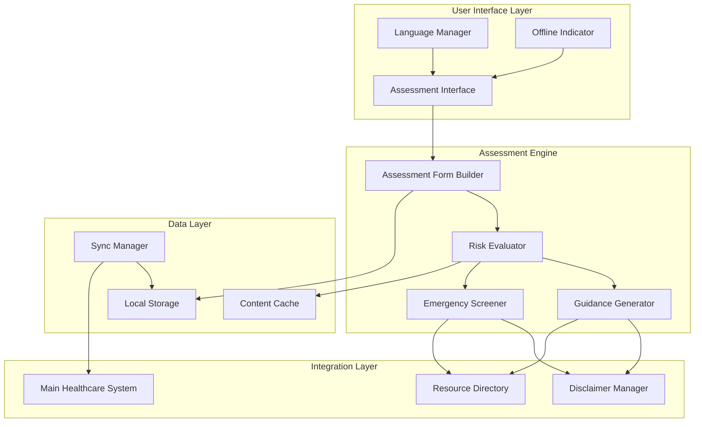

# Design Document: Working Conditions Assessment

## Overview

The Working Conditions Assessment feature provides a structured, safety-first approach to evaluating workplace health and safety conditions in rural Indian contexts. Built as an integrated component of the AI Rural Healthcare Assistant system, it serves ASHA workers, ANM staff, and rural community members across agricultural, construction, and small manufacturing environments.

The system maintains strict safety boundaries by providing guidance on occupational health risks without diagnosing conditions or prescribing treatments. It operates offline-first to accommodate poor connectivity in rural areas and supports Hindi, Marathi, and English with culturally appropriate content.

Key research findings inform the design:
- Major occupational health concerns in rural India include silicosis, musculoskeletal injuries, pesticide poisoning, respiratory diseases, and noise-induced hearing loss
- Agricultural workers face chemical, biological, ergonomic, psychosocial, and physical hazards
- Construction workers experience musculoskeletal issues, heat exhaustion, hearing loss, and respiratory conditions from dust exposure
- ASHA workers successfully use mobile health applications when designed for low digital literacy contexts
- Multilingual support (Hindi/English/Hinglish) is essential for effective rural healthcare technology adoption

## Architecture

The system follows a modular, offline-first architecture that integrates with the existing AI Rural Healthcare Assistant infrastructure:



## Components and Interfaces

### Assessment Form Builder

**Purpose**: Creates customized assessment forms based on occupation type and user context.

**Key Responsibilities**:
- Generate occupation-specific question sets (agriculture, construction, manufacturing)
- Adapt form complexity based on user digital literacy indicators
- Support multi-language form rendering
- Maintain assessment state during interruptions

**Interface**:
```typescript
interface AssessmentFormBuilder {
  createForm(occupation: OccupationType, language: Language): AssessmentForm
  addCustomQuestions(form: AssessmentForm, riskFactors: RiskFactor[]): AssessmentForm
  validateFormData(formData: FormData): ValidationResult
  saveFormProgress(formId: string, progress: FormProgress): void
}

interface AssessmentForm {
  id: string
  occupation: OccupationType
  language: Language
  sections: FormSection[]
  progress: FormProgress
  estimatedDuration: number
}
```

### Risk Evaluator

**Purpose**: Analyzes assessment data to identify potential workplace health risks without making medical diagnoses.

**Key Responsibilities**:
- Map workplace conditions to known occupational health risk factors
- Prioritize risks by potential severity and prevalence
- Generate risk profiles specific to rural Indian contexts
- Maintain clear boundaries between risk identification and medical diagnosis

**Interface**:
```typescript
interface RiskEvaluator {
  evaluateRisks(assessmentData: AssessmentData): RiskProfile
  prioritizeRisks(risks: RiskFactor[]): PrioritizedRiskList
  checkEmergencyConditions(assessmentData: AssessmentData): EmergencyAlert[]
  generateRiskSummary(riskProfile: RiskProfile, language: Language): RiskSummary
}

interface RiskProfile {
  workplaceId: string
  identifiedRisks: RiskFactor[]
  riskLevel: RiskLevel
  emergencyFlags: EmergencyAlert[]
  assessmentDate: Date
}
```

### Guidance Generator

**Purpose**: Provides culturally appropriate, non-diagnostic safety recommendations based on identified risk factors.

**Key Responsibilities**:
- Generate preventive safety measures for identified risks
- Provide culturally relevant examples and terminology
- Ensure all guidance includes appropriate safety disclaimers
- Adapt recommendations for resource constraints in rural settings

**Interface**:
```typescript
interface GuidanceGenerator {
  generateGuidance(riskProfile: RiskProfile, language: Language): SafetyGuidance
  getPreventiveMeasures(riskFactor: RiskFactor): PreventiveMeasure[]
  formatForLowLiteracy(guidance: SafetyGuidance): SimplifiedGuidance
  addCulturalContext(guidance: SafetyGuidance, region: Region): ContextualizedGuidance
}

interface SafetyGuidance {
  riskFactorId: string
  preventiveMeasures: PreventiveMeasure[]
  culturalExamples: string[]
  resourceRequirements: ResourceRequirement[]
  disclaimer: SafetyDisclaimer
}
```

### Emergency Screener

**Purpose**: Identifies immediate workplace hazards requiring urgent attention and escalation.

**Key Responsibilities**:
- Detect emergency conditions from assessment data
- Trigger immediate safety warnings and action steps
- Provide healthcare resource contact information
- Log emergency incidents for follow-up

**Interface**:
```typescript
interface EmergencyScreener {
  screenForEmergencies(assessmentData: AssessmentData): EmergencyResult
  generateImmediateActions(emergency: EmergencyAlert): ImmediateAction[]
  getEmergencyContacts(location: Location): HealthcareResource[]
  logEmergencyIncident(incident: EmergencyIncident): void
}

interface EmergencyResult {
  hasEmergency: boolean
  emergencyAlerts: EmergencyAlert[]
  immediateActions: ImmediateAction[]
  recommendedContacts: HealthcareResource[]
}
```

### Language Manager

**Purpose**: Handles multi-language support with cultural appropriateness for rural Indian contexts.

**Key Responsibilities**:
- Manage translations for Hindi, Marathi, and English
- Adapt technical terminology for local understanding
- Maintain cultural sensitivity in health messaging
- Support mixed-language scenarios (Hinglish)

**Interface**:
```typescript
interface LanguageManager {
  translateContent(content: string, targetLanguage: Language): string
  getLocalizedTerminology(medicalTerm: string, language: Language): LocalizedTerm
  validateCulturalAppropriateness(content: string, language: Language): ValidationResult
  getSupportedLanguages(): Language[]
}
```

### Offline Storage Manager

**Purpose**: Enables full functionality without internet connectivity through local data management.

**Key Responsibilities**:
- Store assessment data locally with encryption
- Cache safety guidance and resource information
- Manage data synchronization when connectivity returns
- Handle storage limitations on mobile devices

**Interface**:
```typescript
interface OfflineStorageManager {
  storeAssessment(assessment: Assessment): Promise<void>
  getCachedGuidance(riskFactorId: string): SafetyGuidance | null
  syncWithServer(): Promise<SyncResult>
  getStorageStatus(): StorageStatus
  clearOldData(retentionDays: number): void
}
```

## Data Models

### Assessment Data Model

```typescript
interface Assessment {
  id: string
  workplaceId: string
  userId: string
  ashaWorkerId?: string
  occupation: OccupationType
  assessmentDate: Date
  language: Language
  responses: AssessmentResponse[]
  riskProfile: RiskProfile
  guidanceProvided: SafetyGuidance[]
  followUpRequired: boolean
  syncStatus: SyncStatus
}

interface AssessmentResponse {
  questionId: string
  questionText: string
  responseValue: string | number | boolean
  responseType: ResponseType
  riskWeight: number
}

enum OccupationType {
  AGRICULTURE = "agriculture",
  CONSTRUCTION = "construction",
  SMALL_MANUFACTURING = "small_manufacturing",
  MIXED = "mixed",
  OTHER = "other"
}
```

### Risk Factor Model

```typescript
interface RiskFactor {
  id: string
  name: string
  category: RiskCategory
  severity: RiskSeverity
  prevalence: number
  occupationTypes: OccupationType[]
  description: LocalizedContent
  indicators: string[]
  emergencyThreshold?: number
}

enum RiskCategory {
  CHEMICAL = "chemical",
  BIOLOGICAL = "biological",
  PHYSICAL = "physical",
  ERGONOMIC = "ergonomic",
  PSYCHOSOCIAL = "psychosocial"
}

enum RiskSeverity {
  LOW = "low",
  MODERATE = "moderate",
  HIGH = "high",
  CRITICAL = "critical"
}
```

### Safety Guidance Model

```typescript
interface SafetyGuidance {
  id: string
  riskFactorId: string
  title: LocalizedContent
  preventiveMeasures: PreventiveMeasure[]
  culturalExamples: LocalizedContent[]
  resourceRequirements: ResourceRequirement[]
  disclaimer: SafetyDisclaimer
  lastUpdated: Date
}

interface PreventiveMeasure {
  id: string
  description: LocalizedContent
  priority: Priority
  costLevel: CostLevel
  implementationDifficulty: Difficulty
  visualAids: string[]
}

interface LocalizedContent {
  hindi: string
  marathi: string
  english: string
}
```

### Healthcare Resource Model

```typescript
interface HealthcareResource {
  id: string
  name: LocalizedContent
  type: ResourceType
  contactInfo: ContactInfo
  location: Location
  services: string[]
  operatingHours: OperatingHours
  governmentFacility: boolean
  specializations: string[]
}

enum ResourceType {
  PRIMARY_HEALTH_CENTER = "phc",
  COMMUNITY_HEALTH_CENTER = "chc",
  DISTRICT_HOSPITAL = "district_hospital",
  ASHA_WORKER = "asha_worker",
  ANM = "anm",
  SPECIALIST_CLINIC = "specialist_clinic"
}
```

## Correctness Properties

*A property is a characteristic or behavior that should hold true across all valid executions of a system—essentially, a formal statement about what the system should do. Properties serve as the bridge between human-readable specifications and machine-verifiable correctness guarantees.*

Based on the prework analysis of acceptance criteria, the following properties ensure the system maintains safety-first principles while providing effective workplace assessment functionality:

### Property 1: Assessment Form Customization
*For any* occupation type selection, the system should generate an assessment form that is specifically customized for that occupation's risk factors and workplace conditions.
**Validates: Requirements 1.3**

### Property 2: Multi-language Support Consistency
*For any* supported language (Hindi, Marathi, English), all system interface elements and content should be consistently displayed in the selected language throughout the user session.
**Validates: Requirements 1.2, 7.2, 7.5**

### Property 3: Local Data Persistence
*For any* assessment data entered by users, the system should store it locally for offline access, regardless of internet connectivity status.
**Validates: Requirements 1.4, 6.2**

### Property 4: Online Synchronization
*For any* locally stored assessment data, when internet connectivity becomes available, the system should automatically synchronize the data with the central system.
**Validates: Requirements 1.5, 6.3**

### Property 5: Risk Factor Identification
*For any* completed workplace assessment, the system should identify relevant risk factors based on the occupation type and workplace conditions provided.
**Validates: Requirements 2.1**

### Property 6: Risk Factor Prioritization
*For any* set of multiple identified risk factors, the system should order them by potential severity with the most severe risks displayed first.
**Validates: Requirements 2.4**

### Property 7: Safety Disclaimer Presence
*For any* risk factor information, safety guidance, or historical data displayed by the system, a safety disclaimer should be included emphasizing the non-diagnostic nature of the information.
**Validates: Requirements 2.5, 3.5, 10.4**

### Property 8: Safety Guidance Provision
*For any* identified risk factor, the system should provide corresponding safety guidance that focuses on preventive measures and environmental modifications.
**Validates: Requirements 3.1, 3.2**

### Property 9: Non-diagnostic Language Compliance
*For any* recommendation or guidance provided by the system, the content should avoid diagnostic language or medical prescriptions.
**Validates: Requirements 3.3**

### Property 10: Cultural Appropriateness
*For any* safety guidance or technical terms displayed, the system should include culturally appropriate examples and simple explanations relevant to rural Indian contexts.
**Validates: Requirements 3.4, 7.3, 7.4**

### Property 11: Emergency Response Protocol
*For any* assessment that detects emergency conditions, the system should immediately display urgent safety warnings, provide immediate action steps, emphasize professional intervention needs, and provide healthcare resource contact information.
**Validates: Requirements 4.1, 4.2, 4.3, 4.4**

### Property 12: Emergency Incident Logging
*For any* activation of emergency protocols, the system should log the incident details for follow-up by healthcare authorities.
**Validates: Requirements 4.5**

### Property 13: Healthcare Resource Provision
*For any* assessment indicating potential health impacts, the system should provide information about nearby healthcare resources, prioritizing government facilities and including contact details and operating hours when available.
**Validates: Requirements 5.1, 5.2, 5.3**

### Property 14: Offline Functionality Preservation
*For any* system functionality, when operating in offline mode, the system should provide full assessment capabilities using cached data and clearly indicate offline status to users.
**Validates: Requirements 6.1, 6.4, 6.5**

### Property 15: Visual Accessibility Support
*For any* information displayed by the system, visual indicators (icons, colors) should accompany text content, and interface elements should use large, clear buttons and text appropriate for low digital literacy users.
**Validates: Requirements 2.2, 2.3, 9.1, 9.2**

### Property 16: Navigation Accessibility
*For any* multi-step assessment or system navigation, clear progress indicators should be provided, and the system should support both touch and keyboard navigation across different device types.
**Validates: Requirements 9.3, 9.5**

### Property 17: Error Message Clarity
*For any* error condition that occurs, the system should display simple, actionable error messages in the user's selected language.
**Validates: Requirements 9.4**

### Property 18: Data Encryption
*For any* personal information collected during assessments, the system should encrypt the data before storage and use secure transmission protocols for online synchronization.
**Validates: Requirements 8.1, 8.2**

### Property 19: Data Access Authorization
*For any* request by healthcare resources to access assessment data, the system should require appropriate authorization and allow users to control sharing of their information.
**Validates: Requirements 8.4, 8.5**

### Property 20: Assessment History Management
*For any* completed assessment, the system should store the assessment in history, display trends when viewing historical data, and highlight changes when multiple assessments exist for the same workplace.
**Validates: Requirements 10.1, 10.2, 10.3**

### Property 21: Follow-up Scheduling
*For any* case where follow-up assessments are recommended, the system should provide scheduling reminders for ASHA workers.
**Validates: Requirements 10.5**

## Error Handling

The system implements comprehensive error handling that maintains safety-first principles:

### Network Connectivity Errors
- **Graceful Degradation**: When network connectivity is lost, the system automatically switches to offline mode without interrupting ongoing assessments
- **User Notification**: Clear offline status indicators inform users of connectivity status
- **Data Preservation**: All assessment data is preserved locally and queued for synchronization when connectivity returns

### Data Validation Errors
- **Input Validation**: All assessment responses are validated before processing to prevent invalid data from affecting risk calculations
- **Error Recovery**: Users receive clear, actionable error messages in their selected language with guidance on how to correct input
- **Progress Preservation**: Form progress is maintained even when validation errors occur

### Emergency Condition Handling
- **Immediate Response**: Emergency conditions trigger immediate safety warnings that override normal system flow
- **Fail-Safe Behavior**: If emergency contact information cannot be retrieved, the system displays general emergency guidance
- **Incident Logging**: All emergency activations are logged locally and synchronized when possible for healthcare authority follow-up

### Language and Localization Errors
- **Fallback Language**: If content is not available in the selected language, the system falls back to English with a notification
- **Character Encoding**: Proper handling of Devanagari script for Hindi and Marathi content
- **Cultural Context Errors**: If culturally appropriate examples are not available, generic safety guidance is provided with appropriate disclaimers

### Storage and Synchronization Errors
- **Storage Limits**: When local storage approaches capacity, older non-critical data is archived or removed with user notification
- **Sync Conflicts**: When synchronization conflicts occur, the most recent assessment data takes precedence with conflict logging
- **Data Corruption**: Corrupted local data is quarantined and users are prompted to re-enter affected assessments

## Testing Strategy

The testing approach combines unit testing for specific scenarios with property-based testing for comprehensive coverage of the system's safety-critical functionality.

### Unit Testing Focus
Unit tests validate specific examples, edge cases, and integration points:

- **Language Selection**: Verify correct language switching and content display
- **Emergency Scenarios**: Test specific emergency condition detection and response
- **Offline Mode Transitions**: Validate smooth transitions between online and offline modes
- **Data Encryption**: Verify encryption implementation for sensitive data
- **Cultural Context**: Test culturally appropriate content for different regions
- **ASHA Worker Workflows**: Validate specific workflows used by ASHA workers

### Property-Based Testing Configuration
Property-based tests verify universal correctness properties across all inputs:

- **Testing Library**: Use Hypothesis (Python) or fast-check (TypeScript) for property-based testing
- **Test Iterations**: Minimum 100 iterations per property test to ensure comprehensive input coverage
- **Test Tagging**: Each property test references its corresponding design document property
- **Tag Format**: **Feature: working-conditions-assessment, Property {number}: {property_text}**

### Safety-Critical Testing Requirements
Given the healthcare context, additional testing requirements ensure safety:

- **Disclaimer Verification**: Every output containing health-related information must include appropriate safety disclaimers
- **Non-Diagnostic Language**: All guidance text is validated to ensure no diagnostic or prescriptive language
- **Emergency Response**: Emergency condition detection and response protocols are tested with high priority
- **Data Privacy**: All personal information handling is tested for encryption and access control compliance

### Integration Testing
- **Healthcare System Integration**: Verify proper integration with the main AI Rural Healthcare Assistant system
- **Resource Directory Integration**: Test healthcare resource information retrieval and display
- **Offline-Online Synchronization**: Validate data consistency across offline and online modes
- **Multi-language Content**: Test content accuracy and cultural appropriateness across all supported languages

### Performance and Usability Testing
- **Low-Resource Devices**: Test functionality on devices with limited processing power and storage
- **Network Conditions**: Validate performance under poor connectivity conditions common in rural areas
- **Digital Literacy**: Test interface usability with users having varying levels of digital literacy
- **Response Times**: Ensure assessment completion times are reasonable for field use by ASHA workers

The dual testing approach ensures both specific functionality works correctly (unit tests) and universal properties hold across all possible inputs (property tests), providing comprehensive coverage for this safety-critical healthcare application.